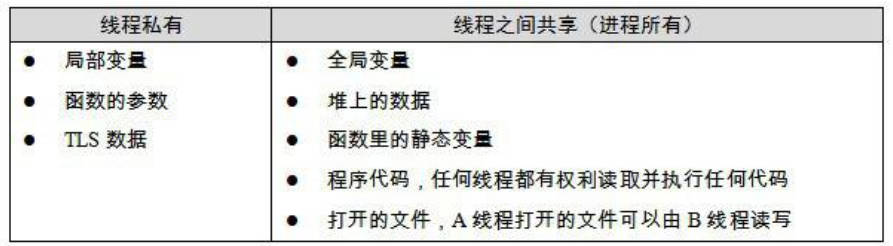
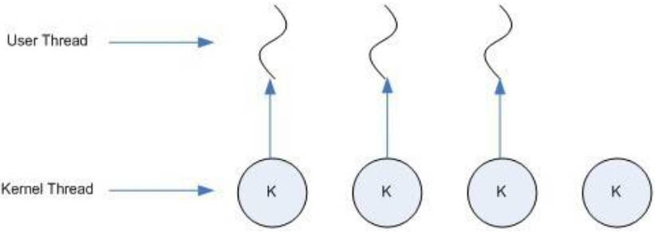
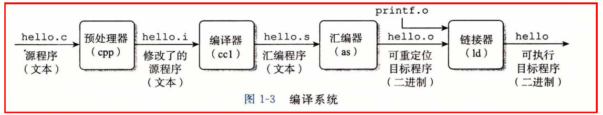
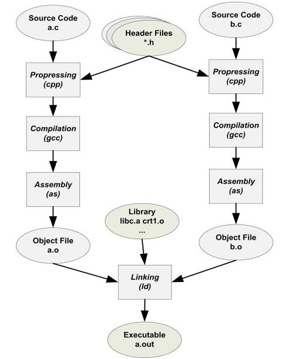
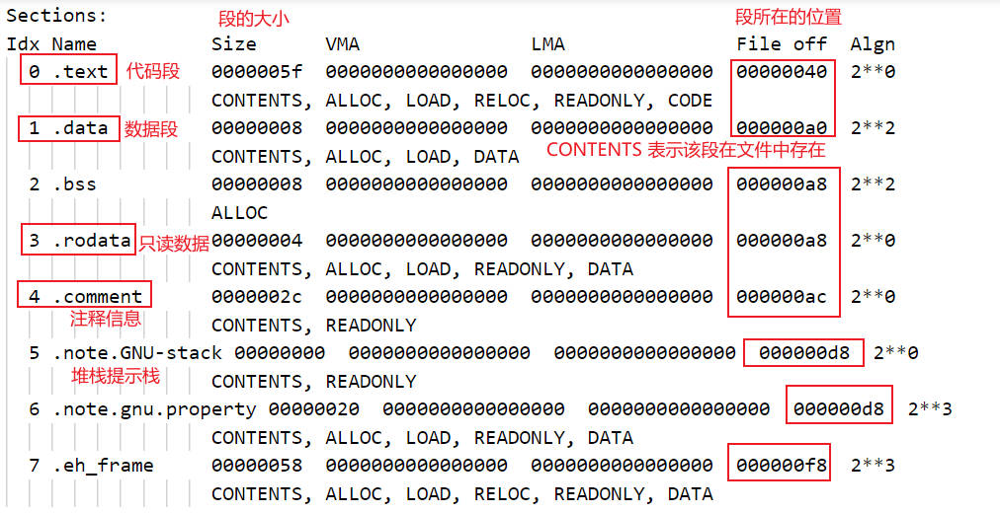
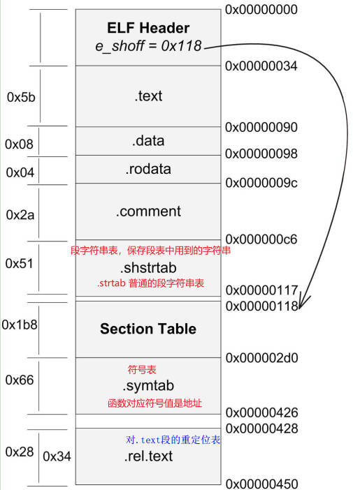
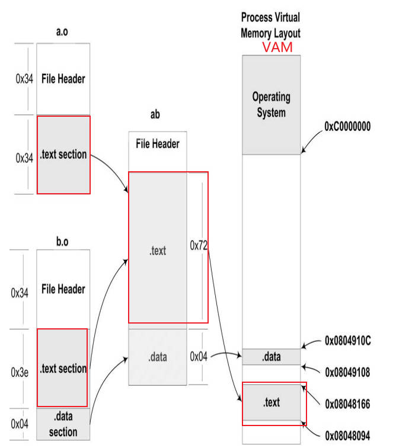

# Linklibrary_intro

> 配合 [CSAPP](https://hansimov.gitbook.io/csapp/) 使用 + 编译原理

## 1.计算机软硬件体系概述

### 1.1 硬件

就系统开发者来说，计算机硬件设备中关心的部件主要有 3 个：CPU，内存，I/O 控制芯片。

早期人们设置高速的北桥 (Northbridge，PCI Bridge) 芯片，用于协调 CPU 和内存间高速交换数据，后续又设计专门处理低速设备的南桥芯片，如键盘，USB，鼠标等都连在南桥上，最后由南桥汇总后将其连接到北桥上。

早期 (20 世纪 90 年代) 的 PC 机系统总线采用的是 PCI 结构，低速设备上采用的是 ISA 总线，即 PCI/ISA 即南北桥设计的硬件架构。

**SMP**

CPU 的频率方面提升在物理方面已经接近极限，人们采用增加 CPU 的数量来提升 CPU 的速度，但是实际提升的效果与数量并不成正比。使用多 CPU 常见的一种形式为：对称多处理器 (SMP，Symmetrical MultiProcessing)，即每个 CPU 的地位等同，相互对称。

**多核处理器**

Multicore Processor，简化版的 SMP，即多个处理器共享成本较高的缓存部件，只保留多核心。

扩展阅读：[The Free Lunch Is Over: A Fundamental Turn Toward Concurrency in Software](http://www.gotw.ca/publications/concurrency-ddj.htm)

### 1.2 软件

传统意义上的区分：

将用于管理计算机本身的软件称为系统软件，可分为：

- 平台性的，操作系统内核，驱动程序，运行库及系统工具；
- 用于程序开发的，编译器，汇编器，连接器等

计算机系统软件体系结构的设计要点：**层次结构设计**，每个层次间通过接口 (Interface) 进行通信。

日常使用的应用程序使用的是操作系统应用程序编程接口 (Application Programming Interface，API)，运行库使用 OS 提供的系统调用接口 (System call Interface)，其往往通过软件中断 (Software Interrupt) 的方式提供。

操作系统内核层是硬件接口的使用者，硬件则是接口的定义者，这种接口也被称为硬件规格 (Hardware Specification)，OS 和驱动程序开发者通过阅读硬件规格文档编写响应的 OS 和驱动程序。

**OS 的作用**

OS，Operating System，操作系统的功能：

- 提供抽象的接口；
- 管理硬件资源；

**并发和并行**

并发 (concurrency)：主要针对单核处理器，单核 CPU 快速切换执行多个程序；

并行 (parallelism)：真正的同时执行 (尤其是执行的程序数量和 CPU 个数相同时)，针对多核处理器，；

### 1.3 CPU/IO/内存

计算机的硬件设备能力是有限且固定的，如何**充分利用硬件的能力**是十分必要的：

- OS 的**多任务功能**使得 CPU 可以在多个进程间很好地共享
- OS 的 **I/O 抽象模型**可很好地实现 I/O 设备的共享和抽象
- 内存管理使用**虚拟地址和分页方法**

**1.充分利用 CPU**

早期的多道程序 (Multiprogramming) 未区分轻重缓急，调度策略粗糙；

分时系统 (Time-Sharing System)，后续改进为一种程序协作模式，每个程序运行一段时间后都会主动出让 CPU 给其他程序，可保证一定时间内每个程序都有机会运行一小段时间，对及时交互处理十分重要；

多任务系统 (Muti-tasking)，操作系统管理所有的硬件资源，本身运行在受硬件保护的级别。所有的程序以进程 (Process) 的方式以权限更低的级别运行，CPU 由 OS 统一调度，每个进程根据优先级的高低都有机会得到 CPU。

**2.设备驱动**

OS 系统中的硬件驱动避免应用程序的开发者与硬件直接打交道，将硬件逐渐抽象为一系列概念。硬件驱动 (Device Driver) 可看作是 OS 的一部分，但与 OS 内核具有一定的独立性，具有较好的灵活性。

**3.内存的分配**

早期的计算机程序直接访问的地址是物理地址，即直接运行在物理内存上，出现的问题：

- 地址空间不隔离，恶意程序容易更改内存空间中的数据
- 内存使用效率低，往往将整个程序转入内存，后续运行其他程序时需要大量数据换入换出
- 程序运行的地址不确定性

解决方法：添加中间层，使用虚拟地址 (Virtual Address) 的间接地址访问算法。

虚拟地址做到了地址隔离，程序被映射到不同的物理空间区域；而为了提供内存的使用率，可以使用分页 (Paging) 的基本方法，将地址空间人为划分为固定大小的页，将常用的代码和数据装载到内存中，不常用的则保存在磁盘中；虚拟储存的实现需要硬件的支持，几乎所有的硬件都采用 MMU (Memory Management Unit) 的部件进行页映射。

### 1.4 线程

**线程简介**

线程 (Thread) 有时称为轻量级进程 (Lightweight Process，LWP)，程序执行流的最小单元。一般来说，一个进程由多个线程组成，各个线程间共享程序的内存空间。

一个标准的线程组成为：

- 线程 ID
- 当前指令指针 PC
- 寄存器集合
- 堆栈

多线程的操作可以有效利用等待的时间；处理消耗大量时间的操作的同时完成和用户的交互；多线程在数据共享方面的效率要高很多。

线程的访问非常自由，它可以访问进程内存中的所有数据，甚至其他线程的堆栈。线程拥有自己的私有存储空间，包括：

- 栈
- 线程局部存储 (Thread Local Storage，TLS)
- 寄存器



**线程调度**

线程数 ≤ 处理器数量：真正的并发执行；而单处理器对应多线程的情况，会不断切换不同的线程，即进程调度 (Thread Schedule)，其中线程的状态为：

- 运行 (Running)
- 就绪 (Ready)
- 等待 (Waiting)

线程拥有时间片 (Time Slice) 用完就会进入就绪状态，如果在用尽前进程就开始等待某个事件，则进入等待状态；当等待事件发生后，就会进入就绪状态。


主流的调度方式都带有优先级调度 (Priority Sechedule) 和轮转法 (Round Robin) 的痕迹。

- 轮转法:：让各个线程轮流执行一小段时间，使得线程交错执行；
- 优先级调度：根据线程的优先级 (Thread Priority) 执行；

**优先级调度**

线程的优先级可以由用户手动设置，系统也会根据线程的表现自动调整优先级；频繁进入等待状态的线程称为 IO 密集型线程 (IO Bound Thread)，少等待的进程称为 CPU 密集型线程 (CPU Bound Thread)，IO 密集型更容易得到优先级的提升。

优先级改变的三种方式：

- 用户指定优先级
- 根据等待状态的频繁程度提升或降低优先级
- 长时间得不到执行而被提升优先级，避免饿死 (Starvation) 的现象

**抢占线程和不可抢占线程**

抢占 (Preemption)：时间片用完后强制剥夺继续执行的权利，进入就绪状态

早期的不可抢占进程需要主动放弃执行：程序试图等待某事件；线程主动放弃时间片；其显著的特点是线程的调度时机确定，有利于线程安全性，但现在很少见。

**Linux 多线程**

Windows 对进程和线程有明确的标准，而 Linux 并不存在真正意义上的线程概念。Linux 将所有的执行实体称为任务 (Task)，类似于一个单线程的进程，但是不同的任务间可以共享内存空间。

**Fork**：本质来说，共享同一个内存空间的多个任务构成了一个进程。fork 函数产生一个和当前进程完全一样的新进程，单并不复制原任务的内存空间，而是和原任务共享一个写时复制 (Copy on Write，COW) 的内存空间。COW 指的是两个任务可同时自由读取内存，任意一个试图更改内存时，内存会提供自身的镜像供修改方单独使用。

fork 一般只能产生本任务的镜像，配合 exec 可以产生 新的任务，如果要产生新线程，可使用 clone。

**线程安全性**

多线程程序在并发时数据的一致性变得非常重要，**避免多个线程同时读写一个数据而产生不可预料的后果**，解决方法：

- 指令操作的原子性 (Atomic)，原子指令具有完整性，本身不可被打断；适用于简单的特定场合
- 同步与锁，保证各个线程访问数据的同步 (Synchronization)，即一个线程访问数据时，其他进程不得访问；保证同步性的常见方法是使用锁

**锁的实现：**

一种非强制的机制，线程访问前先获得锁，其后的线程会等待，直到该线程访问后释放锁；

- 二元信号量 (Binary Semaphore) 为最简单的一种锁，只允许一个线程访问资源，两种状态：占用；非占用，**同一信号量可以由一个线程获取，另一个线程释放**
- 多元信号量，简称信号量 (Semaphore)，允许多信号量并发访问
- 互斥量 (Mutex) ，与二元信号量类似，仅允许一个线程访问，**但是互斥量的获取和释放应是同一个线程**
- 临界区 (Critical Section) 比互斥量更加严格，获取临界区的锁表示进入临界区，释放则为离开；**互斥和信号量在系统的任何进程都是可见的，而临界区仅限于本进程，且同一线程获取和释放**
- 读写锁 (Read-Write Lock)，对于读取频繁，偶尔写入的情况，信号量，互斥量，临界区操作非常低效。读写锁 2 种获取方式：共享的 (shared) 或独占的 (exclusive)，锁处于共享状态时，其他线程可以以共享的方式获取
- 条件变量 (Condition Variable) 作用类似于一个栅栏，线程有 2 操作：等待条件变量；唤醒条件变量；**可以让多个线程一起等待某个事件的发生，事件发生时可以一起恢复执行**

**函数重入**：

 (Reentrant)，表示该函数没有执行完成，又进入函数执行。**函数可重入可保障并发的安全性，可重入函数可在多线程环境下放心使用** ，一个函数可重入，只有 2 种情况：

- **多个线程同时执行这个函数**
- 函数自身调用自身

一个函数可重入，表示该函数重入后不产生任何不良后果。因此函数需满足：

- 不用任何 (局部) 静态或全局的非 const 变量
- 不用任何 (局部) 静态或全局的非 const 变量的指针
- 仅依赖调用方提供的参数
- 不依赖单个资源锁
- 不调用不能重入的函数

**过度优化**

CPU 为提高效率往往会对指令进行优化，如交换指令的顺序，可以使用 volatile 关键字阻止：

- 阻止编译器将一个变量缓存到寄存器而不写回
- 阻止编译器调整指令顺序 (volatile 无法做到)

为解决 CPU 的乱序执行能力，可使用 barrier 指令

**三种线程模型**

用户实际使用的线程是**用户态的用户线程，不一定对应操作系统同数量的内核线程**，用户态多线程库的实现方式：

- 1 to 1：用户使用的线程在内核中有唯一对应使用的线程，反之不一定。这样保证和内核线程相一致，**并发是真正的并发**。但是线程数量受限制且上下文切换开销大，效率降低



- 多对一模型：多个用户线程映射到一个内核线程上，线程间通过用户态代码切换。虽然线程的数量几乎没有限制，但是一个用户线程阻塞了，所有线程都无法执行

- 多对多模型：结合多对一和一对一优点，多个用户线程映射到不止一个内核线程上，提升幅度介于两者之间

## 2.编译和链接

一般使用的 IDE 内部集成编译和链接，通常将编译和链接合并在一起的过程称为构建 (Build)。

```c
#include<stdio.h>
int main()
{
    printf("HellO!\n");
    return 0;
}
```

**过程**

1.预处理 (Prepressing)

将源码和包含的头文件预编译为  `.i` 文件，处理 `#` 定义的预编译指令，展开宏定义，删除所有的注释

```bash
gcc -E hello.c -o hello.i
```

2.编译 (Compilation)

进行语法分析，词法分析，语义分析。构建的核心部分，**生成汇编代码文件 `.s`**。实际上 gcc 只是后台程序的包装，它会根据不同的参数要求调用预编译程序 ccl，汇编器 as，链接器 ld

```bash
gcc -S hello.i -o hello.s
```

3.汇编 (Assembly)

汇编代码转变为可执行的**机器语言 `.o`**，没有复杂语法和语义，根据对照表一对一翻译即可

```bash
gcc -c hello.c -o hello.o
```

**4.链接 (Linking)**

早期使用机器语言或汇编语言编写依赖于特定的机器，高级语言使得程序员更加关注程序逻辑本身，而少考虑计算机本身的限制。



### 2.1 编译过程

1. 扫描 (scanner)：进行词法分析，将源代码分割成一系列 Token，并对 token 进行分类，如关键字，标识符，字面量，特殊符号等，另外对于含有一些预处理操作语言，一般另设一个独立的预处理器实现（实现程序-lex）
2. 语法分析 (Grammar Parser)：对扫描后的结果进行语法分析，从而产生语法树 (Syntax Tree)，整个过程采用上下文无关语法 (Context-free Grammer) 的分析手段，确定运算符的优先级和符号的含义。（实现程序-yacc，yet another compiler compiler）
3. 语义分析 (Semantic Analyzer)：编译器能分析的语义是静态语义 (static semantic)，即可在编译期确定的语义，包含隐式类型转换，标识类型。而动态语义 (dynamic semantic) 只有在运行期才可确定，如除 0 错误。整个语法树都被表示了类型
4. 源代码优化 (Source Code Optimizer)：源代码将整个语法树转换为中间代码 (intermdeiate code)，与运行环境和目标机器无关；
5. 代码生成器 (Code Generator)： 依赖目标主机将中间代码转化为目标机器代码；
6. 目标代码优化器 (Target Code Optimizer) ：则对生成的代码进行优化；

gcc 编译器几乎支持所有的 CPU 平台，这页导致了指令生成过程更加复杂；

### 2.2 链接过程

现代大型软件往往拥有千万个模块，增加其阅读性，重用性，且每个模块可单独开发，编译，测试等，而各个模块最终如何组合发挥功能则涉及到模块间的 "通信" 问题，如模块间函数的调用和变量的访问，最终归结为**模块间符号的引用**。

### 2.3 静态链接

对于大型复杂的软件，程序的模块化是十分必要的；链接的主要内容就是把各个模块间相互引用的部分处理好，保证各个模块间的正确衔接，包括：

- 地址和空间分配 (address and storage allocation)
- 符号决议 (symbol resolution)，也称为名称绑定 (name binding)
- 重定位 (relocation)

最基本的静态链接过程为：

链接器会根据引用的符号寻找对应的地址，最终修正为真正的地址。修正地址的过程叫做重定位 (Relocation)，每个被修正的地方叫一个重定位入口 (Relocation Entry)。



## 3.目标文件

以 `*.o` 结尾的目标文件是编译后的可执行文件格式，只是还没有经过链接，与最后生成的可执行文件稍有不同，Windows 下的 `.obj` 文件和 Linux 下的 `.o` 文件。

### 3.1 内容

主流的可执行文件格式: Windows-PE (Protable Executable) 以及 Linux-ELF (Executable Linkable Format)，都是 COFF (Common file format) 格式的变种。

动态链接库 (dynamic linking library, DLL), Windows 中的 `.dll` 和 Linux 中的 `.so` 格式；

静态链接库 (static linking library), windows 中的 `.lib` 和 Linux 中的 `.a` 文件格式；

目标文件根据信息属性的不同，分别按节 (section)/段 (segment)进行存储，如数据放在数据段 (data section) ，指令放在代码段 (code section)；

将数据和代码分开存放的原因：

- 现在的缓存器分为数据缓存和指令缓存；
- 指令是只读的，数据是可读写的；
- 共享指令，节省内存；

```c
/*
 * source code: simple_section.c
 * Linux command: gcc -c simple_section.c
 * 得到编译后但未连接的 .o  文件
 */
int printf(const char* format, ...);

int global_init_var = 84;
int global_uninit_var;
static int global_static_var;

extern int reference_to_out;

void func1(int i) {
    printf("%d\n", i);
}

int main(void) {
    static int static_var = 85;
    static int static_var2;

    int a = 1;
    int b;

    func1(static_var + static_var2 + a + b);

    return a;
}
```



```bash
# 查看text    data     bss 三个段的大小，dec及hex 分别是三者和的十进制表示和十六进制表示
command: size simple_section.o
text    data     bss     dec     hex  filename
 219       8       8     235      eb  simple_section.o
```

指定变量所在的段：`__attribute__((section("name")))`，将变量前后加双下滑线，可放在 "name" 段中；

借助 objcopy 工具，将图片，音乐，词典等作为目标文件的一个段；


### 3.2 位态调试工具

32 位态调试工具 DB 下载地址：[tools](https://down.52pojie.cn/Tools/Debuggers/)

64 位态调试工具 x64dbg| [intro(看雪论坛)](https://bbs.kanxue.com/homepage-803227.htm)

### 3.3 ELF 文件结构

```bash
# 查看 simple_section.o真正的段表结构
readelf -S simple_section.o > true_segment_table.txt
# 查看表头内容
readelf -h simple_section.o > elfheader.txt
```



**C++ 的符号修饰机制**

- 多个不同参数类型的函数拥有一样的名字—函数重载；
- 提供命名空间，不同的名称中间中可以有多个同样名字的符号；
- 函数的身份特征，函数签名 (Function Signature)，包含函数名，参数类型，所在的类和名称空间等信息；
- 最终结合函数名，参数类型，名称空间等生成修饰后的函数名称

而不同的编译器采用不同的名字修饰方法，则会导致不同编译器产生的目标文件无法正常相互链接；

C++ 的宏 `__cplusplus` 用来判断当前编译单元是否是 C++ 代码，分别采用对应的措施；

## 4.静态链接

多输入文件，链接器将各段合并输出，进行空间和地址的分配一般采用的方案是—相似段合并，用这种方法的链接器一般采用两步链接 (Two-pass Linking)：

1. 扫描所有的输入文件，获得各个目标文件段的长度并进行合并；
2. 核心操作—符号解析和重定位；



### 4.1 符号解析和重定位


